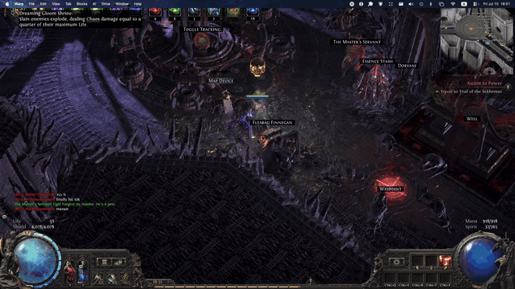

# Path of Exile 2 on Mac (Apple Silicon)

Run Path of Exile 2 natively on your Mac. No Windows, no virtual machine, no cloud streaming. Native resolution, one click to play, and a launcher that repairs itself when things break.



*Real footage: 4K gameplay on an M4 Max, macOS menu bar and all.*

This repo is the distilled result of weeks of real-world setup, crashes, and fixes on an M4 Max running macOS 26. Everything in here exists because something actually broke and we figured out why.

**What you get:**
- A step-by-step setup guide (this file)
- A one-click "Play POE2" app for your Desktop that auto-repairs the known failure points before every launch
- A repair tool (`poe2-heal`) for when things still go sideways
- A [troubleshooting guide](docs/TROUBLESHOOTING.md) mapping every crash we hit to its actual cause and fix

**What you bring:**
- An Apple Silicon Mac (M1 or newer; 16 GB+ RAM recommended)
- macOS 15 or newer
- ~160 GB of free disk space (the game is ~150 GB). An external SSD works, an internal drive is faster.
- A Path of Exile 2 account (get the game from [pathofexile.com](https://www.pathofexile.com) - use the **standalone installer**, not Steam)

> This project contains **no game files and no Wine/D3DMetal binaries**. You install those yourself from their official sources. See [DISCLAIMER.md](DISCLAIMER.md).

---

## How it works (30 seconds)

POE2 is a Windows game that renders with DirectX 12. On a Mac, this stack translates it in real time:

```
Path of Exile 2 (Windows .exe)
      | DirectX 12 calls
Wine  (runs the .exe, no Windows needed)
      |
D3DMetal  (translates DirectX 12 -> Metal, from Apple's Game Porting Toolkit)
      |
Metal -> your Mac's GPU
```

The "wrapper" is a normal-looking Mac app that bundles Wine + D3DMetal + a fake `C:` drive where the game lives. This repo doesn't replace the wrapper - it makes living with one painless.

---

## Setup

### Step 1: Create the wrapper and install the game

1. Download **Sikarugir** (a free, open source Wine wrapper app for macOS) from its official GitHub releases: <https://github.com/Sikarugir-App/Sikarugir>
2. Use it to create a new wrapper app. When asked for an engine, pick a D3DMetal capable one. This guide is tested against **WineCX 24.x**; newer engines (WineSikarugir 10.x) also support D3DMetal, I just haven't tested them with POE2 as thoroughly yet. (D3DMetal itself ships inside the Sikarugir app; engines provide the wine side, `winemetal.dll`.)
3. Name the wrapper something obvious like `POE2.app`. Put it wherever you have space - an external SSD is fine.
4. Download the POE2 **standalone installer** from pathofexile.com, then run it inside the wrapper (Sikarugir has an "install software" flow). Let it download the full game. This takes a while - it's ~150 GB.
5. Launch the game once from the wrapper to confirm it starts, then quit it.

If step 5 works, the hard part is over.

### Step 2: Install this repo's launcher

Pick whichever feels less scary. Both do the same thing.

**Option A: paste one line** (recommended)

1. Press Cmd+Space, type `Terminal`, press Enter. A window with text appears. Don't worry, you only need it this once.
2. Copy this whole line, paste it into that window, and press Enter:

```sh
curl -fsSL https://raw.githubusercontent.com/0ximu/poe2-on-mac/main/install.sh | zsh
```

3. Answer the questions it asks (it may ask you to drag your wrapper app into the window - literally drag the app icon from Finder onto the Terminal window, then press Enter).

**Option B: download and double-click**

1. Click the green **Code** button at the top of this page, then **Download ZIP**.
2. Open your Downloads folder. The ZIP unpacks itself into a `poe2-on-mac-main` folder.
3. Inside it, **right-click** `Install POE2 Launcher.command` and choose **Open** (the right-click is needed once, because macOS is suspicious of downloaded scripts - that's a good instinct, and you can read every line of this one).
4. Answer the questions in the window that appears.

Either way, the installer will:
- find your wrapper (or ask you to drag it into the window - dragging is fine, it's not cheating)
- wire everything up
- put a **Play POE2** app on your Desktop with the game's icon
- run a health check

### Step 3: Play

Double-click **Play POE2**. That's the whole workflow from now on.

First launch after a game patch is slow (shader rebuild, up to a minute to the menu). That's normal.

---

## Settings that matter

Set these in game (Options > Graphics). In-game changes persist; hand-editing the config file often gets silently reverted.

| Setting | Value | Why |
|---|---|---|
| Renderer | **DirectX 12** | The only renderer that works through D3DMetal. Vulkan crashes instantly on Mac. |
| Frame rate cap | Your display's refresh rate (usually 60) | Chasing more than the panel shows just adds heat and stutter. |
| Engine Multithreading | **Disabled** if you get freezes | The single biggest stability lever. Costs some FPS. Must be changed in game, not in the file. |
| Dynamic Resolution | On, if FPS dips | Holds your frame rate by rendering slightly below native under load. |
| Textures / Shadows | Medium / Low on 16 GB Macs | Also reduces streaming stutter if the game lives on a USB drive. |

More detail (and every crash we've ever diagnosed) in [docs/TROUBLESHOOTING.md](docs/TROUBLESHOOTING.md).

---

## When something breaks

1. Run the repair tool first. It fixes the most common silent breakages in seconds:
   ```sh
   ~/.local/bin/poe2-heal
   ```
   (The Play POE2 app already runs these exact checks quietly before every launch; running the tool manually is for when something is still broken after, and shows you the full report.)
2. Still broken? Check [docs/TROUBLESHOOTING.md](docs/TROUBLESHOOTING.md) - find your symptom, apply the fix.
3. Using Claude Code or another AI assistant? Point it at this repo. It ships a [CLAUDE.md](CLAUDE.md) with the full diagnostic playbook (where the logs are, what each crash signature means, what's safe to touch), so the AI can debug your setup instead of guessing.
4. Still broken? Open an issue here with the last ~30 lines of the game log:
   ```
   <YourWrapper.app>/Contents/SharedSupport/prefix/drive_c/Program Files (x86)/Grinding Gear Games/Path of Exile 2 - poe2_production/logs/Client.txt
   ```

---

## Honest expectations

This is a translation layer running a AAA game on hardware it was never built for. It works well - native-res gameplay at solid frame rates on Apple Silicon - but it is not bulletproof:

- Occasional freezes can happen in very busy scenes (the game has a 15 second watchdog and will close itself rather than hang your Mac). The settings above make this rare, not impossible.
- Game patches occasionally change things. If a patch breaks something, open an issue.
- If the game lives on a slow USB drive, zone loading will stutter. Thunderbolt or internal storage fixes it.

## Credits

- [Sikarugir](https://github.com/Sikarugir-App/Sikarugir) - the wrapper app this is built around
- [Wine](https://www.winehq.org/) / [CrossOver](https://www.codeweavers.com/crossover) - the Windows compatibility layer
- Apple's Game Porting Toolkit - D3DMetal
- Grinding Gear Games - Path of Exile 2 (buy their supporter packs, they earned it)

## License

The scripts and docs in this repo are [MIT licensed](LICENSE). The game, Wine, CrossOver and D3DMetal belong to their respective owners - see [DISCLAIMER.md](DISCLAIMER.md).
